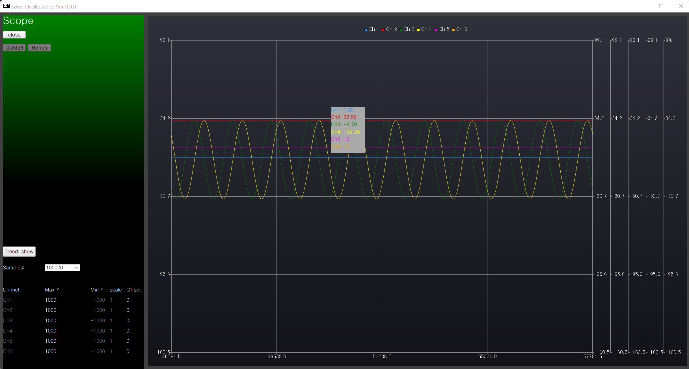

# serial_scope 
 - serial port data to scope

## Development Environment
 - Qt 5.15.2

## Features
 - max 6 channel supported 
 - All log data save to csv file which is 100MB size, consecutively.
 - limit, scale, offset setting avaliable
 - zoom in, zoom out function(just draw rectangle you want to zoom in/out with mouse )
 - show legend

## Data Structure(total 30bytes)
 - preamble(4bytes): { 0xaa, 0xaa, 0xaa, 0xab }  
 - data(24bytes): float * 6 (channel)
 - crc16(2bytes): this caculation only data part.

## HowTo 
 - load .pro file to Qt Creator 
 - just send {0xaa, 0xaa, 0xaa, 0xab, 24bytes, crc16 }
 - [Trend hidden] button click to show trend

## Screen shot
 